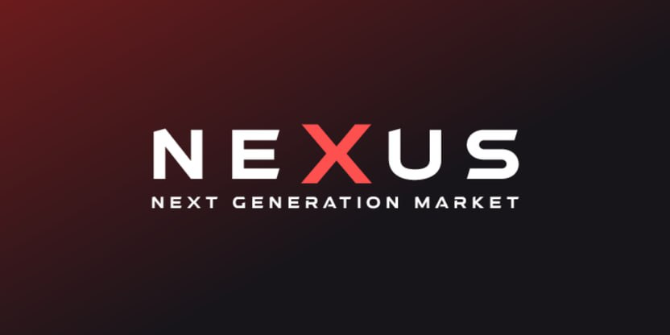

Here's a modern, engaging welcome section for your **nexus darknet shop** README.md:

# 👋 Welcome to **nexus darknet shop** - Your Trusted Global **nexus darknet access** Platform! 🌍

We're dedicated to providing top-quality **nexus darknet access** to customers worldwide, with a strong reputation for reliability and customer satisfaction. 🥇 With **nexus darknet shop**, you can easily discover, purchase, and receive **nexus darknet access** from the comfort of your own home. 📦

Here is a features section for a **nexus shop url** README.md based on the provided criteria:

## Key Features of **nexus shop url**

🌍 **Global Logistics & Delivery**: Our international **logistics** network spans over 150 countries, ensuring your **nexus darknet url** arrives safely and promptly. With real-time tracking and reliable **delivery** partners, you can trust us to handle your orders with utmost care.

💫 **Advanced Payment Options**: We support a wide range of **digital payments**, from traditional credit cards and bank transfers to modern **blockchain-based** currencies. Our system seamlessly integrates multiple payment gateways, providing you with unparalleled convenience and flexibility.

📞 **Professional Customer Support**: Our dedicated **customer service** team is available 24/7 to assist you with any queries or concerns. We pride ourselves on delivering exceptional support, ensuring your experience with **nexus shop url** is nothing short of remarkable.

🔒 **Robust Transaction Security**: Safeguarding your transactions is our top priority. Our platform employs state-of-the-art encryption and advanced **transaction protection** measures to prevent unauthorized access and fraud. Shop with confidence, knowing your sensitive information is secure.

🕵️ **Financial Privacy**: We respect your right to privacy. Our **privacy features** allow you to transact discreetly, keeping your financial details confidential. Whether you prefer traditional payments or opt for anonymous **blockchain** transactions, **nexus shop url** protects your financial privacy.

## Trust and Reliability 🔒

At **nexus market**, we prioritize the security, privacy, and reliability of our platform to ensure a seamless and trustworthy experience for our users. 🌟

### Advanced Platform Protection Measures 🛡️

We employ state-of-the-art security measures to safeguard your data and transactions. Our platform utilizes industry-standard encryption protocols, multi-factor authentication, and regular security audits to maintain the highest level of protection. Rest assured that your information is secure with us. 💪

### Financial Privacy and Transaction Anonymity 🕵️

We understand the importance of financial privacy. **nexus market** implements advanced techniques to ensure the anonymity of your transactions. Your sensitive financial information is kept confidential, giving you peace of mind while using our platform. 🙌

### Modern Payment Processing 💳

**nexus market** supports a wide range of payment methods, including traditional options and cutting-edge technologies like **blockchain**. We stay at the forefront of payment innovation to provide you with convenient and secure ways to transact. Whether you prefer credit cards, bank transfers, or digital currencies, we've got you covered. 😊

### Multi-Currency Support and Digital Assets 💰

Our platform embraces the future of finance by supporting multiple currencies, including traditional fiat and emerging **nexus official site**. We believe in the potential of digital assets and strive to provide a seamless experience for users who want to explore this exciting realm. With **nexus market**, you can easily manage and transact with various currencies and digital assets. 🚀

### Decentralized Transaction Protection ⛓️

By leveraging decentralized technologies, **nexus market** adds an extra layer of security to your transactions. Our decentralized architecture ensures that your funds are protected against single points of failure and unauthorized access. You can trust that your transactions are secure and tamper-proof. 🔐

### Platform's Proven Track Record ⏰

**nexus market** has a proven track record of reliability and availability. Our platform boasts an impressive uptime, ensuring that you can access your funds and perform transactions whenever you need to. We have a dedicated team working round the clock to maintain the stability and performance of our platform. With **nexus market**, you can count on a reliable and consistent experience. 💯

Join **nexus market** today and experience the peace of mind that comes with a trusted and reliable platform. Your security, privacy, and satisfaction are our top priorities. Start exploring the future of finance with us now! 🌍💸

Here is a benefits section for a **nexus market** README.md:

## Key Benefits of **nexus market** 🌟

⭐ **Global Marketplace**: Tap into a worldwide network of **nexus onion mirror** professionals and services. Our platform connects you with top talent from around the globe, giving you access to a diverse range of skills and expertise to enhance your **nexus market** projects.

⭐ **Secure Payments**: Enjoy peace of mind with our secure and reliable payment system. **nexus market** ensures that your transactions are protected, allowing you to focus on your core business while we handle the financial aspects of your **nexus onion mirror** partnerships.

⭐ **Professional Support**: Get the assistance you need, whenever you need it. Our dedicated support team is available 24/7 to address any questions or concerns you may have regarding your **nexus market** experience, ensuring a smooth and hassle-free journey.

⭐ **Platform Reliability**: Count on **nexus market** for a robust and dependable platform. With advanced technology and regular updates, we strive to provide a seamless and uninterrupted experience for all users, enabling you to collaborate with **nexus onion mirror** experts without any technical hiccups.

Here is a getting started section for a **nexus market** README.md:

## Getting Started with **nexus market**

Follow these steps to start using the **nexus market** platform securely and easily:

1. 🔐 Set up account protection:
   - Enable two-factor authentication (**2FA**) for an extra layer of security
   - Use a strong, unique password and consider a **password manager**
   - Keep your account recovery options up to date

2. 💳 Configure payment system:
   - Add a payment method like a **credit card** or **bank account** 
   - Verify your identity for increased **transaction limits**
   - Enable **transaction notifications** to monitor activity

3. 🪙 Learn the transaction system:
   - Familiarize yourself with **nexus market**'s interface for **sending** and **receiving** funds
   - Double-check recipient **addresses** before confirming transactions  
   - Take advantage of **address book** to save frequent contacts

4. 🔍 Explore additional features:
   - Set up **recurring transactions** to automate payments
   - Review **transaction history** and export **statements** 
   - Customize **security settings** like spending limits and approved IP addresses

You're ready to start using **nexus market** for secure, convenient transactions! 

Here is a support section for a **nexus shop url** README.md:

## 🆘 Support

Get world-class support for **nexus shop url** from our dedicated team. We're here to help you succeed! 

- 👨‍💻 24/7 expert **nexus onion mirror** assistance 
- 📞 Multiple support channels including phone, email, live chat
- ⏰ Rapid response times, usually within 1 hour
- 🌟 Professional team with deep **nexus shop url** expertise

Whether you have questions, need help with setup, or run into any issues, our friendly and knowledgeable support staff are standing by to assist you. We pride ourselves on delivering the best customer support experience possible. 

Get in touch today and experience our top-notch support for yourself! 

